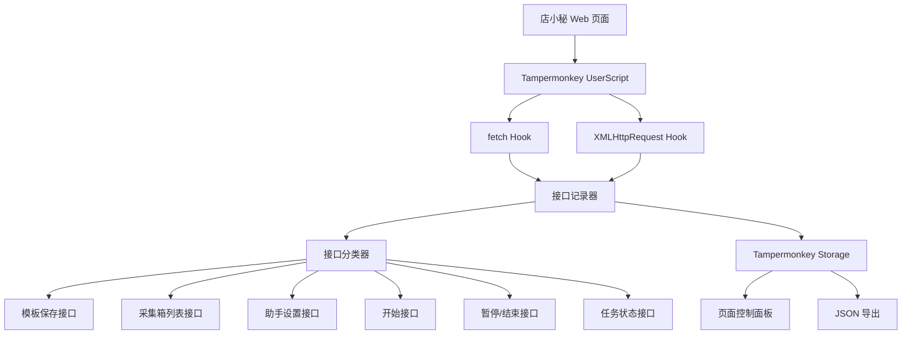

# 店小秘自动化系统 V1 交付说明

## 技术架构图



## 项目目录结构

```text
dianxiaomi-automation-v1/
  README.md
  DELIVERABLE.md
  src/
    dianxiaomi-interface-detector.user.js
    dianxiaomi-interface-detector-v2.user.js
    dianxiaomi-auto-executor.user.js
  docs/
    architecture.md
    install.md
    test-plan.md
    executor-v1.md
    v2-save-json-analysis.md
    3-json-save-payload-analysis.md
    payload-dry-run-test-report.md
  tools/
    analyze-v2-save-json.py
    build-save-payload-dry-run.py
    diff-save-payload.py
```

## Tampermonkey 脚本 V1

接口探测器脚本文件：

```text
src/dianxiaomi-interface-detector.user.js
```

自动执行器脚本文件：

```text
src/dianxiaomi-auto-executor.user.js
```

接口探测器 V2 脚本文件：

```text
src/dianxiaomi-interface-detector-v2.user.js
```

核心能力：

- Hook `fetch`
- Hook `XMLHttpRequest`
- 记录请求 URL、方法、请求头、请求体、响应状态、响应摘要、耗时、页面上下文
- 自动标记以下接口候选：
  - 模板保存接口
  - 采集箱列表接口
  - 助手设置接口
  - 开始接口
  - 暂停/结束接口
  - 任务状态接口
- 页面右下角控制面板
- 支持暂停/继续记录
- 支持清空记录
- 支持导出 JSON

## 安装方法

1. 在 Chrome 安装 Tampermonkey。
2. 打开 Tampermonkey 控制面板。
3. 点击“添加新脚本”。
4. 复制 `src/dianxiaomi-interface-detector.user.js` 的全部内容。
5. 粘贴到 Tampermonkey 编辑器并保存。
6. 打开店小秘后台并登录。
7. 页面右下角出现“店小秘自动化 V1”面板，即为安装成功。

## 测试步骤

1. 打开店小秘采集箱一级页面。
2. 刷新采集箱列表。
3. 进入一个模板产品编辑页。
4. 保存模板产品。
5. 返回采集箱一级页面。
6. 打开助手设置。
7. 保存助手设置。
8. 点击开始。
9. 等待任务状态变化。
10. 点击暂停或结束。
11. 点击面板“导出 JSON”。

## 验收标准

导出的 JSON 中应包含多条网络记录，并至少命中以下候选接口中的多项：

- 模板保存接口
- 采集箱列表接口
- 助手设置接口
- 开始接口
- 暂停/结束接口
- 任务状态接口

## 第二阶段：自动执行器 V1

已新增：

```text
src/dianxiaomi-auto-executor.user.js
docs/executor-v1.md
```

执行器能力：

- 导入第一阶段探测器记录
- 粘贴导出的接口 JSON
- 复用店小秘登录态发起真实 `fetch` 调用
- 单步调用接口
- 执行自动流程
- 记录已验证可调用接口
- 导出执行报告

优先动作：

1. 自动保存模板
2. 自动返回采集箱
3. 自动刷新采集箱
4. 自动启动助手
5. 自动读取任务状态
6. 自动结束/暂停任务

接口参数说明和测试步骤见：

```text
docs/executor-v1.md
```

## 24 小时 V1 目标

本版本已完成可安装、可运行、可测试的接口探测器和自动执行器。自动执行器可导入第一阶段接口记录，并在店小秘登录页面内发起真实接口调用，验证自动保存模板、刷新采集箱、启动助手、读取任务状态、结束/暂停任务。

## V2 更新

已新增探测器 V2，用于展开 `save.json` 的 `FormData / File / Blob`：

```text
src/dianxiaomi-interface-detector-v2.user.js
docs/v2-save-json-analysis.md
```

V2 新增：

- FormData 字段展开
- File/Blob 文本读取
- JSON blob 自动解析
- 点击路径记录
- 页面跳转链路记录
- 关键接口过滤

## Payload Dry-run

已新增：

```text
tools/build-save-payload-dry-run.py
tools/diff-save-payload.py
docs/payload-dry-run-test-report.md
```

测试结果：

```text
真实 payload 字段数：32
构造 payload 字段数：32
缺失字段：0
多余字段：0
风险字段差异：0
diffCount：0
pass：true
```

当前阶段未调用真实 `save.json`。
