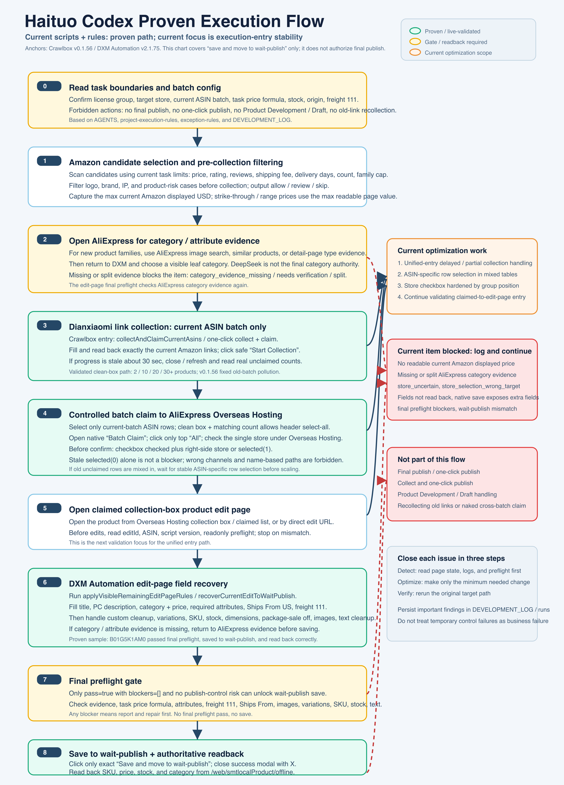
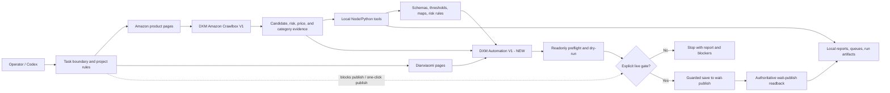

<!-- SEO Meta Tags
Description: Haituo Codex Project is a gated Tampermonkey automation system for Dianxiaomi listing preparation, Amazon candidate routing, evidence stores, and DXM save preflight.
Keywords: Dianxiaomi automation, Tampermonkey userscript, Amazon product collection, AliExpress category evidence, DXM save preflight, browser automation
author: Haituo Codex Project maintainers
canonical: https://github.com/samyuxuan164-afk/haituo-codex-project
-->

<!-- Open Graph
og:type: website
og:url: https://github.com/samyuxuan164-afk/haituo-codex-project
og:title: Haituo Codex Project - Gated Dianxiaomi Automation
og:description: Browser userscripts, local evidence tools, safety gates, and audit-ready documentation for controlled Dianxiaomi listing preparation.
og:image: docs/assets/architecture-overview-en.png
-->

<div align="center">

# Haituo Codex Project

Controlled Dianxiaomi listing automation with Tampermonkey userscripts, local evidence stores, and explicit safety gates.

[](https://github.com/samyuxuan164-afk/haituo-codex-project)
[](https://github.com/ALdaisuki/haituo-codex-project)


**English** | [简体中文](README.zh-CN.md)

</div>

<p align="center">
  
</p>

## Table Of Contents

- [What This Project Does](#what-this-project-does)
- [Current Safety Boundary](#current-safety-boundary)
- [Active Source Matrix](#active-source-matrix)
- [Architecture Overview](#architecture-overview)
- [Repository Map](#repository-map)
- [Local Verification](#local-verification)
- [Documentation Index](#documentation-index)
- [Known Gaps](#known-gaps)

## What This Project Does

Haituo Codex Project is Sam's company collaboration project. The company upstream repository is `samyuxuan164-afk/haituo-codex-project`; `ALdaisuki/haituo-codex-project` is the collaborator fork used for review and PR preparation.

This repository is a browser automation workspace for preparing Dianxiaomi listings from Amazon product candidates. It is not a blind click bot. The repository combines:

- Tampermonkey userscripts for Amazon candidate scanning and Dianxiaomi edit-page assistance.
- Local Node.js and Python tools for evidence capture, policy checks, dry-run reports, readback, and cleanup.
- JSON schemas, thresholds, category maps, and product-risk rules.
- Operational skills and project rules that define when live business actions are allowed.
- Curated run evidence and audit documentation.

The core workflow is:

```text
Amazon candidate
-> risk and price evidence
-> AliExpress category evidence
-> Dianxiaomi collection/edit context
-> readonly preflight or dry-run
-> explicit live gate
-> save to wait-publish only when authorized
-> authoritative readback
```

## Current Safety Boundary

This documentation and architecture work does not authorize any live Dianxiaomi action.

Always forbidden by default:

- Final publish.
- One-click publish.
- Claiming to `产品开发` or `草稿箱`.
- Using stale Dianxiaomi prices, cached UI numeric scans, or manual CNY overrides.
- Falling back Origin from United States to Mainland China.

Live collection, claim, edit, or save actions require the current `TASK.md` boundary and an explicit user start command.

Before any live business action, read:

1. `AGENT.md`
2. `AGENTS.md`
3. `TASK.md`
4. `docs/current-status.md`
5. `docs/project-execution-rules.md`
6. The relevant `skills/*/SKILL.md`

## Active Source Matrix

The versions below are source-visible versions extracted from `src/*.user.js` headers.

| Component | Version | Source | Role |
|---|---:|---|---|
| DXM Automation V1 - NEW | 2.1.75 | `src/dianxiaomi-automation-v1-merged-new.user.js` | Main edit-page automation, readonly preflight, dry-run, guarded recovery |
| DXM Amazon Crawlbox V1 | 0.1.50 | `src/dianxiaomi-amazon-crawlbox-v1.user.js` | Amazon candidate scanning, ASIN dedupe, controlled collection-box preparation |
| save.json Payload Capture V3 | 0.6.3 | `src/dianxiaomi-save-payload-capture-v3.user.js` | Capture and inspect Dianxiaomi save/publish FormData payloads |
| Interface Detector V2 | 0.3.0 | `src/dianxiaomi-interface-detector-v2.user.js` | Record requests, FormData, click paths, and save.json evidence |
| Single Submit Tester | 0.2.5 | `src/dianxiaomi-single-submit-tester.user.js` | Single-product dry-run and guarded save.json testing |
| Auto Executor V1 | 0.2.0 | `src/dianxiaomi-auto-executor.user.js` | Historical interface-call executor |
| Interface Detector V1 | 0.1.0 | `src/dianxiaomi-interface-detector.user.js` | Historical fetch/XHR detector |
| DXM Automation V1 - Merged | 1.1.22 | `src/dianxiaomi-automation-v1-merged.user.js` | Historical main merged script |
| DXM Amazon Crawlbox NEW V1 | 0.1.23 | `src/dianxiaomi-amazon-crawlbox-v1-new.user.js` | Historical crawlbox variant |
| Tampermonkey Execution Diagnostic | 0.0.1 | `src/dianxiaomi-tm-execution-diagnostic.user.js` | Read-only execution diagnostics |

If the browser shows different versions, treat the browser as stale until explicitly refreshed or overwritten.

## Architecture Overview

The full English architecture document is [docs/architecture.md](docs/architecture.md). The Chinese version is [docs/architecture.zh-CN.md](docs/architecture.zh-CN.md).



## Repository Map

| Path | Responsibility |
|---|---|
| `src/` | Tampermonkey userscripts. This is the executable browser automation surface. |
| `tools/` | Node.js and Python utilities for evidence capture, dry-run reports, policy checks, readback, and cleanup. |
| `config/` | JSON schemas, thresholds, category maps, and product-risk rules. |
| `docs/` | Architecture, install, testing, audit, execution rules, and status documents. |
| `skills/` | Operational skills and project-specific rules required before live actions. |
| `runs/` | Curated run evidence and screenshots. Treat as evidence, not source. |
| `analysis/` | Offline payload and run-analysis bundles. |

## Local Verification

There is no package manifest or unified test runner yet. Use the safe local baseline:

```powershell
node tools\aliexpress-evidence-policy.test.js
node tools\dxm-automation-core.test.js
git ls-files "*.js" "*.mjs" | ForEach-Object { node --check $_ }
@'
import ast, subprocess
for path in subprocess.check_output(['git', 'ls-files', '*.py'], text=True).splitlines():
    ast.parse(open(path, encoding='utf-8').read(), filename=path)
print('python ast ok')
'@ | python -
node -e "const {execFileSync}=require('child_process');const fs=require('fs');for(const f of execFileSync('git',['ls-files','*.json'],{encoding:'utf8'}).trim().split(/\r?\n/).filter(Boolean)){JSON.parse(fs.readFileSync(f,'utf8'))}console.log('json ok')"
git diff --check
```

Latest documented results are in [docs/test-results.md](docs/test-results.md).

## Documentation Index

| Document | Purpose |
|---|---|
| [README.zh-CN.md](README.zh-CN.md) | Chinese project entrypoint |
| [docs/architecture.md](docs/architecture.md) | English 13-section architecture document |
| [docs/architecture.zh-CN.md](docs/architecture.zh-CN.md) | Chinese 13-section architecture document |
| [docs/architecture-ascii.md](docs/architecture-ascii.md) | English C4-style ASCII architecture map |
| [docs/architecture-ascii.zh-CN.md](docs/architecture-ascii.zh-CN.md) | Chinese C4-style ASCII architecture map |
| [docs/audit-2026-07-06.md](docs/audit-2026-07-06.md) | Documentation, version, encoding, and test audit |
| [docs/install.md](docs/install.md) | Current source-visible install and enablement guide |
| [docs/test-plan.md](docs/test-plan.md) | Layered test strategy |
| [docs/test-results.md](docs/test-results.md) | Latest safe local verification results |

## Contribution Route

Changes should be prepared on the collaborator fork first, audited there, and then proposed to the company upstream repository:

```text
local worktree
-> ALdaisuki/haituo-codex-project feature branch
-> fork-side diff/privacy audit
-> PR to samyuxuan164-afk/haituo-codex-project
```

Do not include local private paths, credentials, cookies, browser profiles, tokens, payload dumps, or personal Codex runtime metadata in PR diffs.

## Maintenance Language

Chinese is the default language for pull request titles, pull request bodies, review discussion, and maintenance notes in this project. Keep code identifiers, exact logs, external platform terms, and English documentation where they are already required, but the default human-facing maintenance explanation should be Chinese. If an upstream reviewer needs English, add an English summary after the Chinese text rather than replacing it.

## Known Gaps

- The main userscript is still large; the first pure modules now live under `src/dxm-automation-core/`, and deeper extraction remains future work.
- There is no unified `npm test` or equivalent safe local command yet.
- Browser/live validation remains procedure-driven because it can mutate business state.
- Historical logs are useful but should not override `TASK.md`, source headers, or current audit docs.
