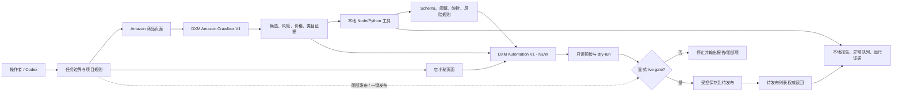

<!-- SEO Meta Tags
Description: Haituo Codex Project 是面向店小秘上架准备流程的 Tampermonkey 自动化系统，包含 Amazon 候选分流、AliExpress 类目证据、DXM 保存预检与审计文档。
Keywords: 店小秘自动化, Tampermonkey 脚本, Amazon 选品采集, AliExpress 类目证据, DXM 保存预检, 浏览器自动化
author: Haituo Codex Project maintainers
canonical: https://github.com/samyuxuan164-afk/haituo-codex-project
-->

<div align="center">

# Haituo Codex Project

带安全闸门的店小秘上架准备自动化：Tampermonkey 脚本、本地证据工具、规则库与审计文档。

[](https://github.com/samyuxuan164-afk/haituo-codex-project)
[](https://github.com/ALdaisuki/haituo-codex-project)


[English](README.md) | **简体中文**

</div>

<p align="center">
  
</p>

## 目录

- [项目定位](#项目定位)
- [当前安全边界](#当前安全边界)
- [当前源码版本矩阵](#当前源码版本矩阵)
- [架构概览](#架构概览)
- [仓库结构](#仓库结构)
- [本地验证](#本地验证)
- [文档索引](#文档索引)
- [已知缺口](#已知缺口)

## 项目定位

Haituo Codex Project 是 Sam 的公司合作项目。公司上游仓库是 `samyuxuan164-afk/haituo-codex-project`；`ALdaisuki/haituo-codex-project` 是协作方 fork，用于提交前审计和 PR 准备。

本仓库是一个面向店小秘上架准备流程的浏览器自动化工作区。它不是无边界点击脚本，而是由规则、证据和显式授权共同控制的自动化系统。

仓库包含：

- 用于 Amazon 候选扫描和店小秘编辑页辅助的 Tampermonkey userscript。
- 用于证据捕获、策略检查、dry-run 报告、读回和清理的 Node.js / Python 工具。
- JSON schema、阈值、类目映射和商品风险规则。
- 定义 live action 边界的项目规则和技能文档。
- 可追踪的运行证据与审计文档。

核心流程：

```text
Amazon 候选商品
-> 风险与价格证据
-> AliExpress 类目证据
-> 店小秘采集/编辑上下文
-> 只读预检或 dry-run
-> 显式 live gate
-> 仅在授权后保存到待发布
-> 权威列表读回
```

## 当前安全边界

本次文档与架构工作不授权任何店小秘真实业务动作。

默认始终禁止：

- 最终发布。
- 一键发布。
- 认领到 `产品开发` 或 `草稿箱`。
- 使用过期店小秘价格、缓存 UI 数字扫描或人工 CNY 覆盖。
- 将 Origin 从 United States 自动回退到 Mainland China。

采集、认领、编辑或保存等 live action 必须同时满足当前 `TASK.md` 边界和用户明确启动命令。

任何 live action 前必须按顺序读取：

1. `AGENT.md`
2. `AGENTS.md`
3. `TASK.md`
4. `docs/current-status.md`
5. `docs/project-execution-rules.md`
6. 相关 `skills/*/SKILL.md`

## 当前源码版本矩阵

以下版本来自 `src/*.user.js` 头部，是源码可见版本，不等同于浏览器当前已安装版本。

| 组件 | 版本 | 源文件 | 职责 |
|---|---:|---|---|
| DXM Automation V1 - NEW | 2.1.75 | `src/dianxiaomi-automation-v1-merged-new.user.js` | 主编辑页自动化、只读预检、dry-run、受控恢复 |
| DXM Amazon Crawlbox V1 | 0.1.50 | `src/dianxiaomi-amazon-crawlbox-v1.user.js` | Amazon 候选扫描、ASIN 去重、采集箱准备 |
| save.json Payload Capture V3 | 0.6.3 | `src/dianxiaomi-save-payload-capture-v3.user.js` | 捕获并分析店小秘 save/publish FormData |
| Interface Detector V2 | 0.3.0 | `src/dianxiaomi-interface-detector-v2.user.js` | 记录请求、FormData、点击路径和 save.json 证据 |
| Single Submit Tester | 0.2.5 | `src/dianxiaomi-single-submit-tester.user.js` | 单品 dry-run 与受控 save.json 验证 |
| Auto Executor V1 | 0.2.0 | `src/dianxiaomi-auto-executor.user.js` | 历史接口调用执行器 |
| Interface Detector V1 | 0.1.0 | `src/dianxiaomi-interface-detector.user.js` | 历史 fetch/XHR 探测器 |
| DXM Automation V1 - Merged | 1.1.22 | `src/dianxiaomi-automation-v1-merged.user.js` | 历史主脚本 |
| DXM Amazon Crawlbox NEW V1 | 0.1.23 | `src/dianxiaomi-amazon-crawlbox-v1-new.user.js` | 历史 Crawlbox 分支 |
| Tampermonkey Execution Diagnostic | 0.0.1 | `src/dianxiaomi-tm-execution-diagnostic.user.js` | 只读执行诊断 |

如果浏览器/Tampermonkey 显示不同版本，必须先视为浏览器环境过期，直到明确刷新或覆盖并复核。

## 架构概览

完整中文架构文档见 [docs/architecture.zh-CN.md](docs/architecture.zh-CN.md)。英文版本见 [docs/architecture.md](docs/architecture.md)。



## 仓库结构

| 路径 | 职责 |
|---|---|
| `src/` | Tampermonkey userscript，浏览器自动化执行面。 |
| `tools/` | Node.js / Python 工具，用于证据、报告、策略、读回和清理。 |
| `config/` | JSON schema、阈值、类目映射和商品风险规则。 |
| `docs/` | 架构、安装、测试、审计、执行规则和状态文档。 |
| `skills/` | live action 前必须遵守的操作技能与项目规则。 |
| `runs/` | 已筛选运行证据和截图；作为证据，不作为源码。 |
| `analysis/` | 离线 payload 与运行分析包。 |

## 本地验证

当前没有 package manifest，也没有统一测试入口。安全本地基线命令：

```powershell
node tools\aliexpress-evidence-policy.test.js
git ls-files "*.js" "*.mjs" | ForEach-Object { node --check $_ }
@'
import ast, subprocess
for path in subprocess.check_output(['git', 'ls-files', '*.py'], text=True).splitlines():
    ast.parse(open(path, encoding='utf-8').read(), filename=path)
print('python ast ok')
'@ | python -
node -e "const {execFileSync}=require('child_process');const fs=require('fs');for(const f of execFileSync('git',['ls-files','*.json'],{encoding:'utf8'}).trim().split(/\r?\n/).filter(Boolean)){JSON.parse(fs.readFileSync(f,'utf8'))}console.log('json ok')"
git diff --check
```

最新记录见 [docs/test-results.md](docs/test-results.md)。

## 文档索引

| 文档 | 用途 |
|---|---|
| [README.md](README.md) | 英文项目入口 |
| [docs/architecture.md](docs/architecture.md) | 英文 13 节完整架构文档 |
| [docs/architecture.zh-CN.md](docs/architecture.zh-CN.md) | 中文 13 节完整架构文档 |
| [docs/architecture-ascii.md](docs/architecture-ascii.md) | 英文 C4 ASCII 架构图 |
| [docs/architecture-ascii.zh-CN.md](docs/architecture-ascii.zh-CN.md) | 中文 C4 ASCII 架构图 |
| [docs/audit-2026-07-06.md](docs/audit-2026-07-06.md) | 文档、版本、编码和测试审计 |
| [docs/install.md](docs/install.md) | 当前源码可见安装与启用说明 |
| [docs/test-plan.md](docs/test-plan.md) | 分层测试策略 |
| [docs/test-results.md](docs/test-results.md) | 最近安全本地验证结果 |

## 协作提交流程

变更应先提交到协作方 fork，完成 fork 侧 diff / 隐私审计后，再向公司上游仓库提交 PR：

```text
local worktree
-> ALdaisuki/haituo-codex-project feature branch
-> fork 侧 diff / 隐私审计
-> PR to samyuxuan164-afk/haituo-codex-project
```

PR diff 不应包含本地私人路径、凭据、cookies、浏览器 profile、tokens、payload dump 或个人 Codex runtime 元数据。

## 已知缺口

- 主 userscript 体积较大，后续应拆分为可测试纯模块。
- 尚无统一 `npm test` 或等价安全本地命令。
- 浏览器/live 验证可能改变业务状态，因此必须保持独立 gated procedure。
- 历史日志有价值，但不能覆盖 `TASK.md`、源码头部和当前审计文档。
