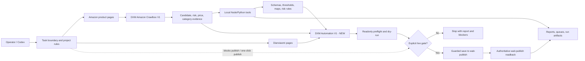
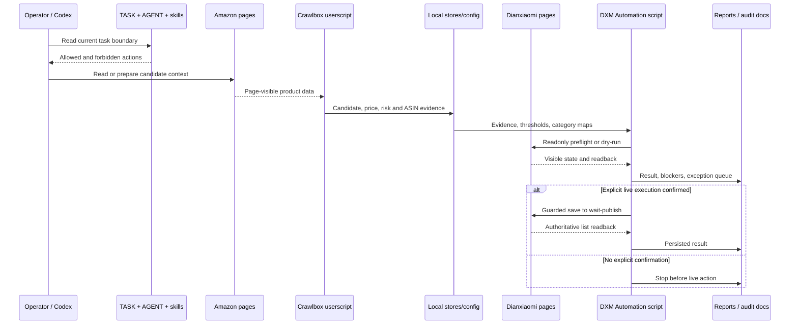

# Haituo Codex Project Architecture

Language: **English** | [简体中文](architecture.zh-CN.md)

  

## 1. System Overview

Haituo Codex Project is a gated browser automation workspace for preparing Dianxiaomi listings from Amazon product candidates. It combines Tampermonkey userscripts, local Node/Python tools, JSON rule stores, execution skills, curated run evidence, and audit documents.

Project ownership is explicit: this is Sam's company collaboration project. The company upstream repository is `samyuxuan164-afk/haituo-codex-project`, and `ALdaisuki/haituo-codex-project` is the collaborator fork used for preparation and review. Changes should land on the collaborator fork first, pass fork-side diff and privacy audit, and only then be proposed to the company upstream by PR.

Maintenance language is also explicit: pull request titles, pull request bodies, review discussion, and maintenance notes default to Chinese. English may remain for code identifiers, exact logs, external platform terms, and bilingual documents, but Chinese is the default human-facing maintenance language.

The system goal is controlled preparation, not unrestricted business execution. It may scan candidates, build evidence, perform readonly preflight, generate dry-run payload reports, and record blockers. Live collection, claim, edit, or save actions require explicit task authorization. Final publish and one-click publish are outside the current target.

## 2. Architecture Diagram

Source files:

- Mermaid workflow: [diagrams/workflow-en.mmd](diagrams/workflow-en.mmd)
- PNG overview: [assets/architecture-overview-en.png](assets/architecture-overview-en.png)
- ASCII overview: [architecture-ascii.md](architecture-ascii.md)

## 3. Component Inventory

| Component | Version | Type | Responsibility |
|---|---:|---|---|
| `dianxiaomi-automation-v1-merged-new.user.js` | 2.1.75 | Tampermonkey userscript | Main Dianxiaomi edit-page automation, readonly preflight, dry-run, guarded recovery |
| `dianxiaomi-amazon-crawlbox-v1.user.js` | 0.1.50 | Tampermonkey userscript | Amazon candidate scanning, ASIN dedupe, controlled collection-box preparation |
| `dianxiaomi-save-payload-capture-v3.user.js` | 0.6.3 | Tampermonkey userscript | Capture `save.json` FormData and choiceSave payload evidence |
| `dianxiaomi-interface-detector-v2.user.js` | 0.3.0 | Tampermonkey userscript | Record requests, FormData, click paths, and page transitions |
| `dianxiaomi-single-submit-tester.user.js` | 0.2.5 | Tampermonkey userscript | Single-product dry-run and guarded save testing |
| `tools/aliexpress-evidence-policy.js` | n/a | Node module | Deterministic AliExpress evidence confidence policy |
| `tools/aliexpress-evidence-capture.js` | n/a | Node tool/module | Build and enrich AliExpress category evidence records |
| `tools/dxm-live-edit-helper.js` | n/a | Node browser helper | Sync evidence stores, run readonly checks, and coordinate gated edit helpers |
| `tools/dxm-batch-execution-gate.js` | n/a | Node gate | Batch readiness and execution preflight checks |
| `tools/cleanup-task-screenshots.js` | n/a | Node utility | Screenshot cleanup planning without touching source or business pages |

## 4. Communication Patterns

The system uses direct browser-page interaction, local files, and explicit human gates.

- Browser userscripts communicate with current page DOM, page globals, Tampermonkey storage, and local browser context.
- Local tools read and write repository files, JSON stores, run reports, exception queues, and evidence bundles.
- No background service is required for the documented safe local checks.
- Live browser operations are procedural and gated; they are not part of the default test path.

## 5. Data Flow

## 6. State And Evidence Management

State is intentionally local and inspectable:

- `config/` stores schemas, thresholds, category maps, and risk rules.
- `runs/` stores curated evidence, screenshots, reports, and readbacks.
- `analysis/` stores offline payload and run-analysis bundles.
- `docs/` stores status, audit, install, test, and architecture documents.
- Browser-installed script state must be verified separately because source headers do not prove Tampermonkey has the same version installed.

## 7. Error Handling Strategy

The system treats uncertainty as a blocker instead of silently continuing:

- Missing category evidence blocks automated category/save decisions.
- Product risk flags block collection or downstream processing.
- Missing price evidence blocks calculated goods-value usage.
- Readonly preflight blockers prevent save.
- Browser-control interruption is classified as environment control failure, not business failure.
- Publish and one-click publish remain blocked independently of other checks.

## 8. Security And Safety Model

Security is mainly operational because the repository controls browser automation for a real business workflow.

| Boundary | Rule |
|---|---|
| Task authorization | `TASK.md` is the current permission boundary. |
| Store/channel safety | Only `速卖通海外托管` is valid for relevant claim flows. |
| Dangerous actions | Publish and one-click publish are blocked. |
| Data sensitivity | Secrets, cookies, tokens, payloads, and browser profiles are ignored by `.gitignore`. |
| Evidence discipline | Screenshots are temporary unless referenced by reports or JSON evidence. |

## 9. Monitoring And Observability

Observability comes from artifacts rather than a central telemetry service:

- Userscript page panels and page globals expose current state.
- Payload capture and interface detector scripts record request and FormData evidence.
- Local tools write JSON, Markdown, and run-bundle reports.
- `docs/test-results.md` records safe local verification.
- `docs/audit-2026-07-06.md` records documentation, version, encoding, and test gaps.

## 10. Scalability Plan

The current architecture scales operationally by tightening gates before increasing volume:

1. Keep live execution disabled by default.
2. Improve safe local tests and version checks.
3. Extract pure logic from large userscripts into testable modules.
4. Use candidate/risk/category pre-judgment before browser execution.
5. Scale from dry-run to small gated live validation only after blockers are resolved.

## 11. Technology Stack

| Layer | Technology |
|---|---|
| Browser automation | Tampermonkey userscripts |
| Local tools | Node.js, Python |
| Rule data | JSON schemas, thresholds, maps, risk lists |
| Documentation | Markdown, Mermaid, SVG, ASCII diagrams |
| Version control | Git, GitHub CLI |
| Runtime pages | Amazon pages, Dianxiaomi pages, AliExpress evidence pages |

## 12. Cost And Operational Constraints

The repository itself has no mandatory cloud runtime. Operational cost is dominated by manual review time, browser validation time, and any external model or product-understanding tools used outside the safe local baseline.

Primary constraints:

- Browser validation can mutate real business state.
- The main userscript is large and needs extraction for deeper automated coverage.
- Long-running status logs can drift from source headers.
- Current tests are safe but shallow.

## 13. Implementation Phases

| Phase | Objective |
|---|---|
| Phase 1: Documentation stabilization | Keep README, install docs, architecture, and audit reports aligned with source headers. |
| Phase 2: Safe local test runner | Add a single command that runs policy tests, JS syntax checks, Python AST parse, JSON parse, SVG XML checks, and doc drift checks. |
| Phase 3: Pure-module extraction | Move category, price, risk, and preflight rules out of the largest userscript into testable modules. |
| Phase 4: Gated browser validation | Keep live validation separate, explicit, logged, and reversible where possible. |
