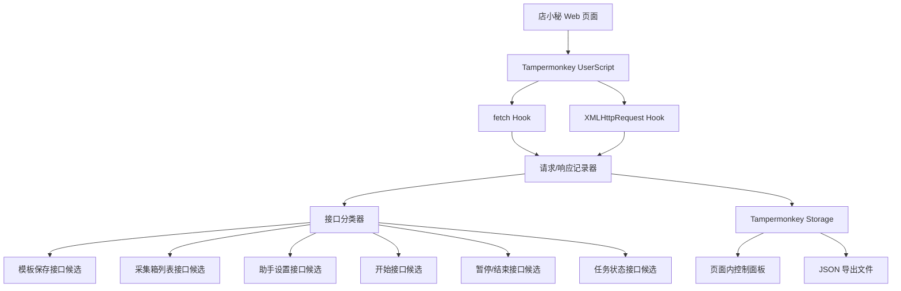

# 店小秘自动化系统 V1 技术架构

## 目标

V1 目标是消除截图、坐标点击、视觉判断和人工页面操作依赖，先建立店小秘页面内接口探测能力，为后续批量执行器提供真实接口依据。

## 架构图

## 核心模块

- `Network Hook`：拦截页面内 `fetch` 和 `XMLHttpRequest`。
- `Recorder`：记录 URL、方法、请求头、请求体、响应状态、响应摘要、耗时、页面上下文。
- `Classifier`：按关键词自动标记接口候选类型。
- `Panel`：页面右下角显示捕获数量、分类数量、导出和清空按钮。
- `Export`：导出 JSON，用于分析真实接口字段和构造下一阶段自动执行器。

## 接口分类

V1 自动记录以下候选接口：

- 模板保存接口
- 采集箱列表接口
- 助手设置接口
- 开始接口
- 暂停/结束接口
- 任务状态接口

## 数据输出

导出的 JSON 包含：

- 当前页面地址和标题
- 请求来源：`fetch` 或 `xhr`
- 请求 URL
- 请求方法
- 请求头
- 请求体摘要
- 响应状态
- 响应体摘要
- 自动分类结果
- 请求耗时
- 捕获时间
