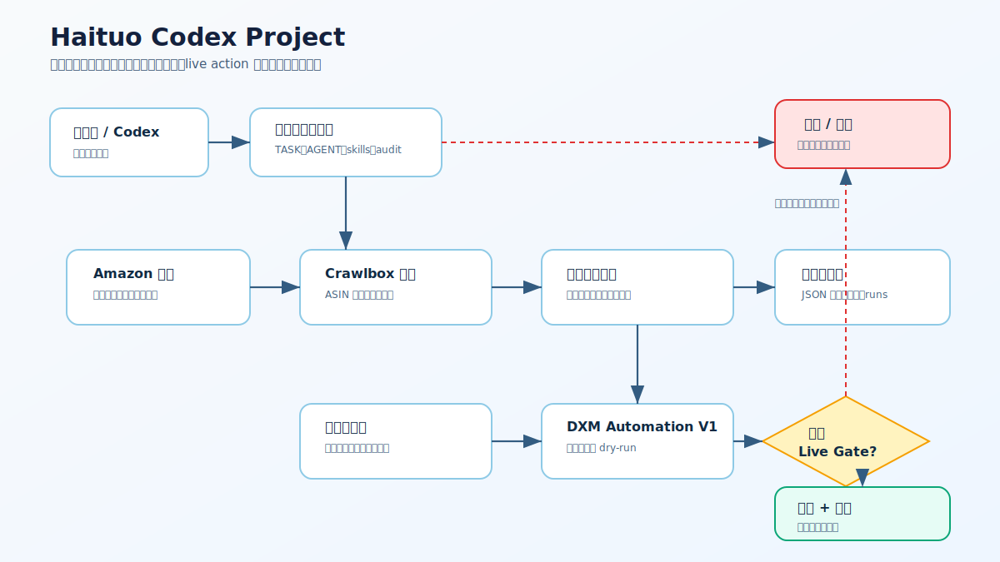
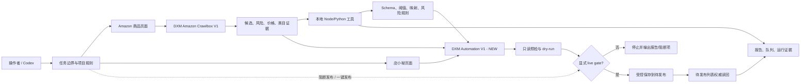
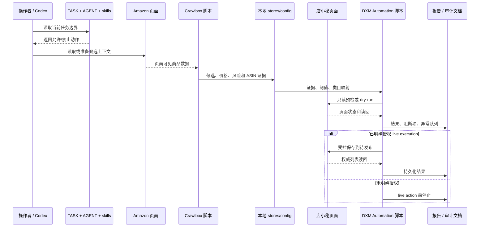

# Haituo Codex Project 架构

语言：[English](architecture.md) | **简体中文**

  

## 1. 系统概览

Haituo Codex Project 是一个带安全闸门的浏览器自动化工作区，用于从 Amazon 候选商品准备店小秘上架资料。系统由 Tampermonkey userscript、本地 Node/Python 工具、JSON 规则库、执行技能、运行证据和审计文档组成。

项目归属需要保持明确：这是 Sam 的公司合作项目。公司上游仓库是 `samyuxuan164-afk/haituo-codex-project`，`ALdaisuki/haituo-codex-project` 是协作方 fork，用于变更准备和审查。变更应先进入协作方 fork，通过 fork 侧 diff 和隐私审计后，再以 PR 形式提交到公司上游仓库。

系统目标是受控准备，而不是无限制业务执行。它可以扫描候选、构建证据、执行只读预检、生成 dry-run payload 报告并记录阻断项。采集、认领、编辑或保存等 live action 需要明确任务授权。最终发布和一键发布不属于当前目标。

## 2. 架构图

源文件：

- Mermaid 工作流：[diagrams/workflow-zh.mmd](diagrams/workflow-zh.mmd)
- SVG 总览：[assets/architecture-overview-zh.svg](assets/architecture-overview-zh.svg)
- ASCII 总览：[architecture-ascii.zh-CN.md](architecture-ascii.zh-CN.md)

## 3. 组件清单

| 组件 | 版本 | 类型 | 职责 |
|---|---:|---|---|
| `dianxiaomi-automation-v1-merged-new.user.js` | 2.1.75 | Tampermonkey userscript | 店小秘主编辑页自动化、只读预检、dry-run、受控恢复 |
| `dianxiaomi-amazon-crawlbox-v1.user.js` | 0.1.50 | Tampermonkey userscript | Amazon 候选扫描、ASIN 去重、采集箱准备 |
| `dianxiaomi-save-payload-capture-v3.user.js` | 0.6.3 | Tampermonkey userscript | 捕获 `save.json` FormData 和 choiceSave payload 证据 |
| `dianxiaomi-interface-detector-v2.user.js` | 0.3.0 | Tampermonkey userscript | 记录请求、FormData、点击路径和页面跳转 |
| `dianxiaomi-single-submit-tester.user.js` | 0.2.5 | Tampermonkey userscript | 单品 dry-run 与受控保存测试 |
| `tools/aliexpress-evidence-policy.js` | n/a | Node 模块 | AliExpress 类目证据置信度策略 |
| `tools/aliexpress-evidence-capture.js` | n/a | Node 工具/模块 | 构建并补充 AliExpress 类目证据记录 |
| `tools/dxm-live-edit-helper.js` | n/a | Node 浏览器辅助工具 | 同步证据、执行只读检查和受控编辑辅助 |
| `tools/dxm-batch-execution-gate.js` | n/a | Node 闸门工具 | 批次准备度与执行前检查 |
| `tools/cleanup-task-screenshots.js` | n/a | Node 工具 | 截图清理计划，不触碰源码或业务页面 |

## 4. 通信模式

系统使用浏览器页面交互、本地文件和显式人工闸门。

- 浏览器脚本与当前页面 DOM、页面全局对象、Tampermonkey storage 和浏览器上下文交互。
- 本地工具读写仓库文件、JSON store、运行报告、异常队列和证据包。
- 安全本地检查不依赖后台服务。
- live 浏览器操作属于 gated procedure，不属于默认测试路径。

## 5. 数据流

## 6. 状态与证据管理

状态保持本地化、可检查：

- `config/` 保存 schema、阈值、类目映射和风险规则。
- `runs/` 保存筛选后的证据、截图、报告和读回。
- `analysis/` 保存离线 payload 和运行分析包。
- `docs/` 保存状态、审计、安装、测试和架构文档。
- 浏览器已安装脚本版本必须单独复核，源码头部不能证明 Tampermonkey 中已经安装同版本。

## 7. 错误处理策略

系统把不确定性处理为阻断项，而不是静默继续：

- 缺少类目证据时阻断自动类目/保存决策。
- 商品风险命中时阻断采集或下游处理。
- 缺少价格证据时阻断货值计算。
- 只读预检存在 blocker 时禁止保存。
- 浏览器控制中断归类为环境控制异常，不归类为业务失败。
- 发布和一键发布独立阻断。

## 8. 安全模型

安全主要是操作安全，因为仓库控制真实业务浏览器流程。

| 边界 | 规则 |
|---|---|
| 任务授权 | `TASK.md` 是当前权限边界。 |
| 店铺/渠道安全 | 相关认领流程只允许 `速卖通海外托管`。 |
| 危险动作 | 发布和一键发布保持阻断。 |
| 数据敏感性 | secrets、cookies、tokens、payloads、浏览器 profile 由 `.gitignore` 排除。 |
| 证据纪律 | 截图默认临时，只有被报告或 JSON 明确引用才应保留。 |

## 9. 监控与可观测性

可观测性由产物提供，而不是中心化 telemetry：

- userscript 面板和页面全局对象暴露当前状态。
- Payload Capture 与 Interface Detector 记录请求和 FormData 证据。
- 本地工具写出 JSON、Markdown 和运行包报告。
- `docs/test-results.md` 记录安全本地验证结果。
- `docs/audit-2026-07-06.md` 记录文档、版本、编码和测试缺口。

## 10. 扩展计划

当前架构先收紧闸门，再扩大规模：

1. live execution 默认禁用。
2. 完善安全本地测试和版本检查。
3. 从大型 userscript 中抽取纯逻辑模块。
4. 在浏览器执行前完成候选/风险/类目预判。
5. 阻断项解决后，再从 dry-run 进入小批量 gated live validation。

## 11. 技术栈

| 层 | 技术 |
|---|---|
| 浏览器自动化 | Tampermonkey userscripts |
| 本地工具 | Node.js, Python |
| 规则数据 | JSON schema、阈值、映射、风险规则 |
| 文档 | Markdown, Mermaid, SVG, ASCII diagrams |
| 版本控制 | Git, GitHub CLI |
| 运行页面 | Amazon 页面、店小秘页面、AliExpress 证据页面 |

## 12. 成本与运行约束

仓库本身没有强制云端运行时。主要成本来自人工复核、浏览器验证时间，以及安全本地基线之外可能使用的外部模型或商品理解工具。

主要约束：

- 浏览器验证可能改变真实业务状态。
- 主 userscript 体积大，需要抽取模块以提升测试覆盖。
- 长状态日志可能与源码头部漂移。
- 当前测试安全但偏浅。

## 13. 实施阶段

| 阶段 | 目标 |
|---|---|
| 阶段 1：文档稳定 | 保持 README、安装文档、架构和审计报告与源码头部一致。 |
| 阶段 2：安全本地测试入口 | 增加单一命令，聚合 policy test、JS syntax、Python AST、JSON parse、SVG XML 和文档漂移检查。 |
| 阶段 3：纯模块抽取 | 从最大 userscript 中拆出类目、价格、风险和预检规则，形成可测试模块。 |
| 阶段 4：gated browser validation | live validation 保持独立、显式、可记录，并尽量可回退。 |
