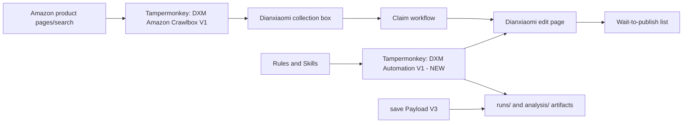

# V1 Freeze Report - 2026-06-25

## Freeze Decision

V1 is frozen for Mac migration preparation. Browser-based Dianxiaomi live validation is paused because the current Windows Browser / Computer Use control channel repeatedly hit environment control exceptions.

This freeze does not mean the business workflow failed. It means the code and rules are preserved at the current state, and live validation resumes tomorrow in the new Mac environment.

## Current Project State

Project path:

```text
D:\自动上架\dianxiaomi-automation-v1
```

Current stage:

```text
V1 code-prepared / live stability validation paused / Mac migration preparation
```

Current completion estimate:

| Area | Completion | Notes |
|---|---:|---|
| Core userscript code preparation | 90% | Main plugin v1.1.41 contains edit-page preflight, category mapping, title brand filtering, freight template selection, custom attribute cleanup, and retry logic. |
| Amazon collection workflow | 80% | Crawlbox v0.1.21 supports default 100 target, category limit 15, duplicate policy, and same-product different-color allowance. |
| Rules / knowledge base | 85% | Project rules, Skills, category resolver, and known issues exist; some older docs show Windows terminal mojibake but source JSON is valid UTF-8. |
| Live end-to-end 3 x 10 validation | Paused | Previous 30-product run reached collection/claim for 28 items; current v1.1.41 live validation blocked by environment control exceptions. |
| Production readiness | Not yet | Final publish is intentionally disabled. Batch publish remains outside current validation scope. |

## Current Versions

| Component | Current version | File | Status |
|---|---:|---|---|
| Main plugin | 1.1.41 | `src/dianxiaomi-automation-v1-merged-new.user.js` | Code prepared, Tampermonkey updated by user, live v1.1.41 verification pending. |
| Legacy merged plugin | 1.1.22 | `src/dianxiaomi-automation-v1-merged.user.js` | Historical reference only. |
| Amazon Crawlbox | 0.1.21 | `src/dianxiaomi-amazon-crawlbox-v1.user.js` | Active collection plugin. |
| Amazon Crawlbox NEW | 0.1.23 | `src/dianxiaomi-amazon-crawlbox-v1-new.user.js` | Experimental / not current active path. |
| save Payload V3 | 0.6.1 | `src/dianxiaomi-save-payload-capture-v3.user.js` | Capture/log support, do not overwrite during current validation unless explicitly needed. |
| Interface detector V2 | 0.3.0 | `src/dianxiaomi-interface-detector-v2.user.js` | Interface discovery support. |
| Auto executor | 0.2.0 | `src/dianxiaomi-auto-executor.user.js` | Auxiliary executor. |
| Single submit tester | 0.2.5 | `src/dianxiaomi-single-submit-tester.user.js` | Test support. |

## Architecture Summary



## Main Modules

| Module | Responsibility | State |
|---|---|---|
| `src/dianxiaomi-automation-v1-merged-new.user.js` | Main edit/save/wait-publish automation. | Active V1 code, v1.1.41. |
| `src/dianxiaomi-amazon-crawlbox-v1.user.js` | Amazon selection, dedupe, link collection, task target/count configuration. | Active collection code, v0.1.21. |
| `src/dianxiaomi-save-payload-capture-v3.user.js` | Capture save payloads and related evidence. | Stable support. |
| `skills/category-resolver/learned_rules.json` | Category mapping and learned category rules. | Active rules, includes Pen Holders mapping. |
| `skills/dxm-edit-page-automation/SKILL.md` | Edit page operational rules. | Active, some terminal output may show mojibake. |
| `skills/dxm-collection-automation/SKILL.md` | Collection and duplicate rules. | Active. |
| `skills/bumpers-v2/known_issues.json` | Known issue and mitigation knowledge base. | Active; updated with environment exception during freeze. |
| `tools/*.py`, `tools/*.mjs` | Payload and category analysis. | Mostly cross-platform; run with Python/Node on Mac. |
| `runs/`, `analysis/` | Evidence, screenshots, reports, payloads. | Must migrate. |

## Functional Status

| Function | Status | Real validation | Next-stage readiness |
|---|---|---|---|
| Amazon product discovery and collection | Completed / partially verified | Prior run collected/claimed 28 of 30. | Ready for Mac re-validation. |
| Duplicate filtering | Completed | Logic updated; same color/size/package exact duplicates filtered, different colors allowed. | Ready for live verification. |
| Same product different colors | Completed | Rule and plugin updated; live full validation pending. | Ready for live verification. |
| Brand/title filtering | Completed in code | Manual issue found and patched before freeze; v1.1.41 live verification pending. | Ready for live verification. |
| Category mapping rules | Completed in code/rules | Pen Holders mapping manually confirmed; broader category correctness pending. | Ready for controlled live verification. |
| Edit-page visible preflight | Completed in code | v1.1.37+ added; v1.1.41 live verification blocked by environment. | Needs first Mac validation. |
| Freight template 111 real selection | Completed in code | Prior failure known; v1.1.37+ patched; live verification pending. | Needs first Mac validation. |
| Custom attributes cleanup | Completed in code | Prior failure known; v1.1.38+ patched; live verification pending. | Needs first Mac validation. |
| Required attributes conservative fill | Completed in code | Needs category-specific live validation. | Needs first Mac validation. |
| Save retry after fixable failure | Completed in code | Pending live verification. | Needs first Mac validation. |
| Final publish | Paused by rule | Not part of current task. | Do not execute until explicitly authorized. |

## Current Results

Prior stability run:

```text
Run: runs/stability-30-20260624-065520
Target: 3 categories x 10 = 30
Collection / claim success: 28
Collection failed/skipped: 2
Edit save attempted: 1
Edit save succeeded: 0
Root cause at that time: category not selected, custom attributes not skipped
```

Current code after that run:

```text
Main plugin v1.1.41
Amazon Crawlbox v0.1.21
Rules updated for brand filtering, category mapping, duplicate handling, and environment exceptions
```

Current blocker:

```text
Environment Control Exception:
Browser control channel cannot operate Dianxiaomi page reliably on current Windows environment.
```

Accounting:

```text
Not a business failure.
Not a plugin failure.
Not a project failure.
Not a product failure.
Not counted against 3 x 10 validation.
```

## Freeze Scope

No business logic changes after this freeze unless a specific V1 hotfix is requested.

No final publish.

Next work should start from Mac environment setup and then resume:

```text
Amazon product
-> collection box
-> claim
-> edit page auto-fill
-> save
-> wait-to-publish
```

