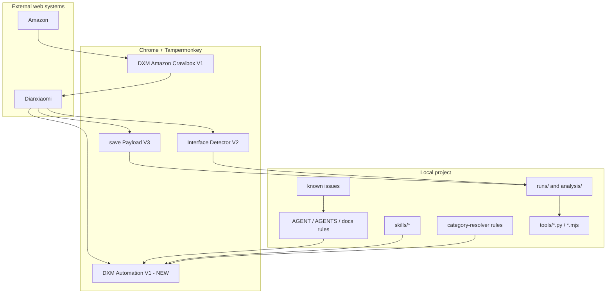

# V1 System Architecture

## System Boundary

V1 automates the existing Dianxiaomi workflow. It does not bypass Dianxiaomi.

```text
Amazon -> Dianxiaomi collection box -> claim -> edit page -> save -> wait-to-publish
```

Final publish is outside the current validation scope.

## Architecture Diagram



## Module Responsibilities

| Module | Responsibility |
|---|---|
| ChatGPT / Codex | Development, rule updates, file edits, verification coordination, documentation. |
| Chrome | Runtime browser for Amazon and Dianxiaomi sessions. |
| Tampermonkey | Hosts all userscripts. |
| DXM Amazon Crawlbox V1 | Selects Amazon products, dedupes, builds link batches, sends to Dianxiaomi collection. |
| DXM Automation V1 - NEW | Main Dianxiaomi automation for claim/edit/save/wait-to-publish. |
| save Payload V3 | Captures save payloads and local evidence. |
| Interface Detector V2 | Finds useful Dianxiaomi interfaces and schema signals. |
| Skills | Durable workflow and business rules. |
| Category Resolver | Learned category mappings and category defaults. |
| Known Issues | Failure classification and mitigations. |
| runs/analysis | Evidence, reports, screenshots, payloads. |

## Stable Modules

```text
save Payload V3
Interface Detector V2
Payload analysis tools
Project rules and Skills structure
```

## Active V1 Modules

```text
DXM Automation V1 - NEW v1.1.41
DXM Amazon Crawlbox V1 v0.1.21
category-resolver learned rules
known issues
```

## Experimental Modules

```text
DXM Amazon Crawlbox NEW V1 v0.1.23
Legacy merged plugin v1.1.22
single-submit tester
auto executor
```

## Pending Modules

```text
Full Mac live validation
Robust browser session recovery
Formal report generator for 3 x 10 runs
V2 modular plugin architecture
```

## State And Recovery

Current runtime state is browser-session dependent. This is the main V1 operational weakness.

V2 should separate:

```text
Task state
Browser state
Product state
Evidence state
Recovery state
```

Each should be persisted outside the browser page where possible.

