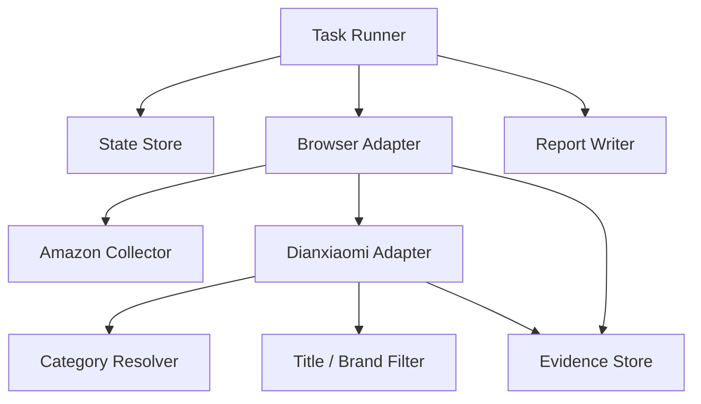

# V2 Upgrade Proposal

This is design only. Do not start refactoring during V1 freeze.

## Why V2

V1 successfully collected rules and implemented major automation patches, but browser session stability and monolithic userscript growth are the main risks.

## V2 Goals

1. Split collection, edit-page automation, category resolver, payload capture, and reporting into separate modules.
2. Persist task state outside the page.
3. Make validation resumable after browser interruption.
4. Separate business failures from environment failures in reports.
5. Add first-class Mac support.

## Proposed Architecture



## V2 Module Split

| Module | Responsibility |
|---|---|
| `task-runner` | Reads task config, controls product queue, resumes after interruption. |
| `browser-adapter` | Browser/session abstraction and timeout classification. |
| `amazon-collector` | Amazon candidate extraction and duplicate handling. |
| `dxm-adapter` | Dianxiaomi page/API operations. |
| `category-resolver` | Category mapping and confidence scoring. |
| `title-policy` | Brand/trademark/model filtering. |
| `report-writer` | Produces run summaries, failure accounting, and efficiency metrics. |
| `state-store` | Product status, task progress, retry counts, evidence paths. |

## V2 Data Model

Persist:

```text
taskId
categoryId/categoryTerm
asin
sourceUrl
variantSignature
collectionStatus
claimStatus
editStatus
saveStatus
waitPublishStatus
failureType
failureReason
evidencePath
```

## V2 Failure Types

```text
business_rule_failure
product_data_failure
platform_validation_failure
environment_control_exception
account_or_permission_block
captcha_or_manual_block
```

## V2 Mac First

V2 should assume POSIX paths and run on Mac first, then keep Windows as a secondary supported environment.

## Do Not Do In V1 Freeze

Do not split the current userscript.

Do not change live business logic.

Do not introduce a new framework tonight.

